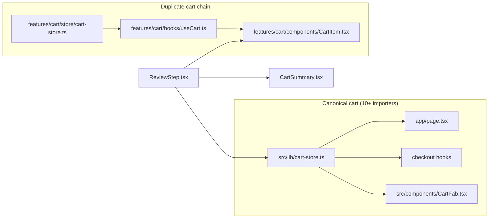

# CODE_AUDIT_REPORT.md

**Project:** juco0-cafe-v4 (Next.js 15 App Router)  
**Audit date:** 2026-06-26  
**Auditor role:** Senior software architect / code auditor  
**Scope:** Full repository static analysis — imports, routes, server actions, dependencies  
**Policy:** Conservative — no files were deleted as part of this audit.

---

## Executive summary

| Category                     |    Count | Notes                                                               |
| ---------------------------- | -------: | ------------------------------------------------------------------- |
| Active App Router pages      |       18 | All `page.tsx` files are reachable                                  |
| Server action files          |       12 | 2 exported functions have zero importers                            |
| High-confidence orphan files |       11 | Legacy mapbox providers, map engine types, duplicate cart FAB, etc. |
| Empty legacy directories     |       12 | Under `src/features/maps/` + `src/providers/google/`                |
| Duplicate cart state         | 2 stores | Same `juco-cart` persist key, different Zustand instances           |
| Unused shadcn UI scaffolds   |      ~40 | Only 5 UI primitives used from `app/` / `features/`                 |
| Unused npm dependencies      |     ~15+ | Plus ~25 scaffold-only Radix packages                               |

**Primary risks if cleaning aggressively:** dual cart stores (checkout display bug), removing forensic debug helpers still used by GPS pipeline, deleting shadcn UI that may be needed for near-term UI work.

---

## Methodology

For each candidate file/function/dependency:

1. Grep for static imports (`@/…`, relative paths).
2. Grep for dynamic `import()` (server actions, mapbox-gl, offline sync).
3. Verify App Router linkage (`app/**/page.tsx`, `layout.tsx`, `route.ts`, `middleware.ts`).
4. Check barrel re-exports (`src/features/live-tracking-v2/index.ts`).
5. Exclude doc-only references (`SAFE_DELETE.md`, `docs/*.md`).

Confidence levels:

- **High** — zero importers in `app/`, `src/`, `middleware.ts`, `scripts/` (excluding self).
- **Medium** — implemented but not mounted; or only referenced in comments/docs.
- **Low** — indirect/runtime/config references possible; or active internal-only chain.

Risk if removed:

- **Low** — no runtime path.
- **Medium** — dev tooling or future feature scaffolding.
- **High** — business logic, routing, or data integrity impact.

---

## Detailed findings

### A. Legacy tracking cleanup remnants (post Phase B/C)

| File                                                                                        | Why unused                                        | Searched                                            | Confidence | Risk    |
| ------------------------------------------------------------------------------------------- | ------------------------------------------------- | --------------------------------------------------- | ---------- | ------- |
| `src/providers/mapbox/destination-marker-icon.ts`                                           | Only consumed by deleted `MapboxRenderer.ts`      | `@/providers/mapbox`, relative imports              | **High**   | **Low** |
| `src/providers/mapbox/driver-marker-icon.ts`                                                | Same                                              | Same                                                | **High**   | **Low** |
| `src/providers/mapbox/store-marker-icon.ts`                                                 | Same                                              | Same                                                | **High**   | **Low** |
| `src/providers/mapbox/mapbox-config.ts`                                                     | Same; V2 uses `live-tracking-v2/config/mapbox.ts` | Same                                                | **High**   | **Low** |
| `src/features/maps/engine/types.ts`                                                         | `MapEngine` deleted; `@deprecated` header         | `@/features/maps/engine/types`, `google.maps` types | **High**   | **Low** |
| `src/providers/google/` (empty dir)                                                         | Google tracking renderer deleted                  | Directory listing                                   | **High**   | **Low** |
| `src/features/maps/components/` (empty)                                                     | Legacy map UI removed                             | Directory listing                                   | **High**   | **Low** |
| `src/features/maps/core/` (empty)                                                           | Snapshot pipeline removed                         | Directory listing                                   | **High**   | **Low** |
| `src/features/maps/tracking/` (empty)                                                       | Factory removed                                   | Directory listing                                   | **High**   | **Low** |
| `src/features/maps/{controllers,engines,guards,hooks,providers,store,types,utils}/` (empty) | No files remain                                   | Directory listing                                   | **High**   | **Low** |

**Still required (do NOT remove):**

| File                                             | Why kept                        | Importers                                                                                          |
| ------------------------------------------------ | ------------------------------- | -------------------------------------------------------------------------------------------------- |
| `src/features/maps/debug/map-forensic-logger.ts` | GPS / delivery forensic logging | `gps.service.ts`, `useDeliveryState.ts`, `useDriverPage.ts`, `use-canonical-delivery-locations.ts` |
| `src/features/maps/debug/map-data-usage.ts`      | Byte telemetry for GPS payloads | `gps-repository.ts`, `use-canonical-delivery-locations.ts`                                         |

---

### B. Duplicate / split implementations

| Item                                           | Why flagged                                                                                                                                           | Searched                      | Confidence             | Risk                                        |
| ---------------------------------------------- | ----------------------------------------------------------------------------------------------------------------------------------------------------- | ----------------------------- | ---------------------- | ------------------------------------------- |
| **Dual cart stores**                           | `src/lib/cart-store.ts` (canonical) vs `src/features/cart/store/cart-store.ts` — both `persist({ name: 'juco-cart' })` but separate Zustand instances | `useCart` imports across repo | **High** (duplicate)   | **High** if removed wrong store             |
| `src/features/cart/components/CartFab.tsx`     | Duplicate of `src/components/CartFab.tsx`; zero importers                                                                                             | `CartFab`, `@/features/cart`  | **High**               | **Low**                                     |
| `src/features/cart/hooks/useCart.ts`           | Only used by `CartItem.tsx` → `features/cart/store`                                                                                                   | `@/features/cart/hooks`       | **High** (miswired)    | **Medium** — refactor to `lib/cart-store`   |
| `src/features/cart/components/CartItem.tsx`    | Uses `features/cart` store, while parent `ReviewStep` uses `lib/cart-store` for totals                                                                | `ReviewStep.tsx`              | **High** (split brain) | **High** — potential checkout cart mismatch |
| `src/features/cart/components/CartSummary.tsx` | Props-only; no store — OK but only importer is `ReviewStep`                                                                                           | `CartSummary`                 | N/A                    | **Low**                                     |
| `src/features/cart/types/cart.types.ts`        | Only `features/cart` chain                                                                                                                            | relative imports              | **Medium**             | **Low** after cart consolidation            |

---

### C. PWA / dev tooling (unmounted)

| File                               | Why unused                         | Searched           | Confidence | Risk                            |
| ---------------------------------- | ---------------------------------- | ------------------ | ---------- | ------------------------------- |
| `src/components/PwaDevCleanup.tsx` | Not imported in `app/layout.tsx`   | `PwaDevCleanup`    | **Medium** | **Low** — dev/tunnel SW cleanup |
| `src/hooks/usePWAUpdate.ts`        | Not mounted anywhere               | `usePWAUpdate`     | **Medium** | **Medium** — prod SW update UX  |
| `src/lib/pwa-update-guard.ts`      | Only imported by `usePWAUpdate.ts` | `pwa-update-guard` | **Medium** | **Medium** — pair with hook     |

**Active PWA (keep):**

| File                                           | Importers                        |
| ---------------------------------------------- | -------------------------------- |
| `src/components/PwaInstallBanner.tsx`          | `app/layout.tsx`                 |
| `src/lib/pwa-legacy-purge.ts`                  | `app/layout.tsx` (inline script) |
| `src/components/ServiceWorkerRegistration.tsx` | `app/layout.tsx`                 |
| `scripts/generate-sw.mjs`                      | `package.json` prebuild          |

---

### D. Dead exports (functions in otherwise-active files)

| Symbol                    | File                                  | Why unused               | Searched    | Confidence | Risk    |
| ------------------------- | ------------------------------------- | ------------------------ | ----------- | ---------- | ------- |
| `assertAdminAction`       | `app/actions/complete-viva-order.ts`  | Exported, never imported | grep symbol | **High**   | **Low** |
| `driverHasActiveDelivery` | `app/actions/driver-delivery-sync.ts` | Exported, never imported | grep symbol | **High**   | **Low** |

---

### E. Stale logic (not orphaned files)

| Item                                                      | File                        | Issue                                                                           | Confidence | Risk                                  |
| --------------------------------------------------------- | --------------------------- | ------------------------------------------------------------------------------- | ---------- | ------------------------------------- |
| `revalidatePath('/menu')`                                 | `app/actions/revalidate.ts` | No `app/menu/page.tsx` — menu is `/`                                            | **High**   | **Low** — harmless no-op revalidation |
| `SAFE_DELETE.md`                                          | repo root                   | References deleted files (`TrackingMap`, `MapboxRenderer`); audit snapshot only | N/A        | **Low**                               |
| `docs/tracking-legacy-removal-plan.md`                    | docs                        | Describes removed stack; historical                                             | N/A        | **Low**                               |
| `docs/tracking-v2-validation.md`                          | docs                        | Checklist doc; still useful                                                     | N/A        | **Low**                               |
| `NEXT_PUBLIC_MAP_PROVIDER` in `env.ts` / `next.config.js` | config                      | `map-provider.ts` deleted; env unused at runtime                                | **High**   | **Low**                               |

---

### F. Shared utilities

| File                                            | Why unused                            | Searched    | Confidence | Risk    |
| ----------------------------------------------- | ------------------------------------- | ----------- | ---------- | ------- |
| `src/shared/utils/client-architecture-guard.ts` | `assertNotClientContext` never called | symbol grep | **High**   | **Low** |

**Active shared utils (keep):** `currency.ts`, `coordinates.ts`, `customer-status.ts`, `order-fields.ts`, `uuid.ts`, `validation.ts`, `with-timeout.ts`, `dev-log.ts` (via `useSafeRouter.ts`).

---

### G. shadcn / Radix UI scaffolds

Only these `src/components/ui/*` are imported from **outside** `ui/`:

| UI module                | External importers            |
| ------------------------ | ----------------------------- |
| `button`                 | `AddressStep.tsx`             |
| `dialog`                 | `LocationPermissionModal.tsx` |
| `dropdown-menu`, `sheet` | `DriverProfileMenu.tsx`       |
| `sonner`                 | `app/layout.tsx`              |

All other ~42 `ui/*.tsx` files are **scaffold-only** (imported only by other unused ui files).

| Pattern                                            | Confidence                 | Risk if bulk-deleted                      |
| -------------------------------------------------- | -------------------------- | ----------------------------------------- |
| Unused ui components + matching `@radix-ui/*` deps | **High** (for current app) | **Medium** — may block rapid UI expansion |

---

### H. npm dependencies (unused or scaffold-only)

#### Clearly unused (no source import)

| Package                     | Evidence                                                          | Confidence | Risk    |
| --------------------------- | ----------------------------------------------------------------- | ---------- | ------- |
| `@base-ui/react`            | lockfile only                                                     | **High**   | **Low** |
| `@googlemaps/js-api-loader` | Google loaded via `integrations/google-maps/loader.ts` script tag | **High**   | **Low** |
| `@hookform/resolvers`       | no imports                                                        | **High**   | **Low** |
| `@vercel/analytics`         | not in `layout.tsx`                                               | **High**   | **Low** |
| `autoprefixer`              | not in `postcss.config.mjs`                                       | **High**   | **Low** |
| `date-fns`                  | no imports                                                        | **High**   | **Low** |
| `dotenv`                    | Next.js native env                                                | **High**   | **Low** |
| `fluent-ffmpeg`             | prebuild uses `@ffmpeg-installer/ffmpeg` spawn only               | **High**   | **Low** |
| `tw-animate-css`            | not in `globals.css`                                              | **High**   | **Low** |
| `zod`                       | no app imports                                                    | **High**   | **Low** |
| `shadcn` (runtime dep)      | CLI tool; should be devDependency if kept                         | **High**   | **Low** |
| `eslint-config-next`        | custom flat `eslint.config.js`                                    | **Medium** | **Low** |

#### Scaffold-only (only via unused `ui/*`)

`cmdk`, `embla-carousel-react`, `input-otp`, `react-day-picker`, `react-hook-form`, `react-resizable-panels`, `recharts`, `vaul`, and ~20 `@radix-ui/react-*` packages.

**Keep (actively used):** `mapbox-gl`, `framer-motion`, `zustand`, `@supabase/*`, `next-themes`, `sonner`, `lucide-react`, `@ffmpeg-installer/ffmpeg`, `tailwindcss`, `@tailwindcss/postcss`.

---

### I. App Router — all routes verified active

No orphaned `page.tsx` files. Key external entry points:

| Route              | Entry                          |
| ------------------ | ------------------------------ |
| `/auth/callback`   | Supabase OAuth redirect        |
| `/order-success`   | Viva `redirectUrl`             |
| `/track/[orderId]` | Checkout + order success links |
| `/driver`          | Middleware cookie guard        |

---

## PHASE 2 — Grouped recommendations

### Safe to remove (100% unused — High confidence)

| #   | Path / item                                                                                                                                       | Notes                                     |
| --- | ------------------------------------------------------------------------------------------------------------------------------------------------- | ----------------------------------------- |
| 1   | `src/providers/mapbox/destination-marker-icon.ts`                                                                                                 | Legacy tracking                           |
| 2   | `src/providers/mapbox/driver-marker-icon.ts`                                                                                                      | Legacy tracking                           |
| 3   | `src/providers/mapbox/store-marker-icon.ts`                                                                                                       | Legacy tracking                           |
| 4   | `src/providers/mapbox/mapbox-config.ts`                                                                                                           | Legacy tracking                           |
| 5   | `src/features/maps/engine/types.ts`                                                                                                               | Legacy MapEngine                          |
| 6   | `src/features/cart/components/CartFab.tsx`                                                                                                        | Duplicate of `src/components/CartFab.tsx` |
| 7   | `src/shared/utils/client-architecture-guard.ts`                                                                                                   | Never imported                            |
| 8   | Empty dirs: `src/providers/google/`, `src/features/maps/{components,core,tracking,controllers,engines,guards,hooks,providers,store,types,utils}/` | No files                                  |
| 9   | `assertAdminAction` export                                                                                                                        | Dead export in `complete-viva-order.ts`   |
| 10  | `driverHasActiveDelivery` export                                                                                                                  | Dead export in `driver-delivery-sync.ts`  |
| 11  | `SAFE_DELETE.md`                                                                                                                                  | Stale audit doc (optional)                |

### Probably unused (manual review recommended)

| #   | Path / item                                                 | Review question                               |
| --- | ----------------------------------------------------------- | --------------------------------------------- |
| 1   | `src/components/PwaDevCleanup.tsx`                          | Mount in layout for dev/tunnel, or delete?    |
| 2   | `src/hooks/usePWAUpdate.ts` + `src/lib/pwa-update-guard.ts` | Wire into layout or remove?                   |
| 3   | `revalidatePath('/menu')` in `revalidate.ts`                | Change to `'/'` only?                         |
| 4   | `NEXT_PUBLIC_MAP_PROVIDER` env wiring                       | Remove from `env.ts` / `next.config.js`?      |
| 5   | `docs/tracking-legacy-removal-plan.md`                      | Archive or delete post-cleanup?               |
| 6   | ~40 `src/components/ui/*.tsx` scaffolds                     | Keep for future UI vs prune + drop Radix deps |
| 7   | Unused npm packages (see §H)                                | Remove in clusters after UI prune             |

### Needs investigation (do not delete without decision)

| #   | Path / item                                    | Why investigate                                                                                                                                                                          |
| --- | ---------------------------------------------- | ---------------------------------------------------------------------------------------------------------------------------------------------------------------------------------------- |
| 1   | **`src/features/cart/` entire feature folder** | **Duplicate cart store** — `CartItem` uses `features/cart/store`, rest of app uses `lib/cart-store`. Same localStorage key but separate in-memory state. **Refactor, not blind delete.** |
| 2   | `src/features/maps/debug/*`                    | Named "maps" but actively used by delivery GPS — rename or keep                                                                                                                          |
| 3   | `src/hooks/usePWAUpdate.ts`                    | May be intended for production SW updates                                                                                                                                                |
| 4   | shadcn UI bulk removal                         | May affect planned admin/checkout UI work                                                                                                                                                |
| 5   | `fluent-ffmpeg` vs `@ffmpeg-installer/ffmpeg`  | Prebuild only needs installer binary today                                                                                                                                               |

---

## Duplicate code summary



**Recommended fix (Phase 4, after approval):** Point `CartItem` / `useCartItem` at `@/lib/cart-store`, delete `features/cart/store`, `hooks`, `types`, orphan `CartFab`, then evaluate if `CartItem`/`CartSummary` should move to `checkout/` or `components/`.

---

## Dependency graph — maps (current)

```
Active:
  mapbox-gl → live-tracking-v2, location/useMapbox
  google-maps/loader.ts → order-destination.service.ts (geocoding)

Dead:
  src/providers/mapbox/* (4 files)
  src/features/maps/engine/types.ts
```

---

## PHASE 3 — Approval gate

**No deletions have been performed.**

Before Phase 4 cleanup, confirm:

- [ ] Approve **Safe to remove** list (§ above)
- [ ] Decision on **cart consolidation** (refactor vs keep)
- [ ] Decision on **PWA update hook** (wire or remove)
- [ ] Decision on **shadcn UI prune** (aggressive vs conservative)
- [ ] Decision on **npm dependency removal** (with or after UI prune)

After approval, Phase 4 will:

1. Delete approved safe files / empty directories
2. Remove dead exports and unused imports
3. Consolidate cart store (if approved)
4. Run `npm run build` + lint
5. Generate `CLEANUP_SUMMARY.md`

---

## Validation checklist (post-cleanup)

```bash
npm run build
npx tsc --noEmit
npm run lint
# Manual smoke:
# - / checkout cart review step
# - /driver map + GPS
# - /track/:id V2 map + timeline
# - /admin orders
```

---

## Files intentionally NOT flagged

| Area                                         | Reason                           |
| -------------------------------------------- | -------------------------------- |
| `src/features/live-tracking-v2/**`           | Primary tracking — active        |
| All `app/**/page.tsx`                        | Routed                           |
| All `app/actions/*.ts` (except dead exports) | Imported by app or features      |
| `middleware.ts`                              | Active auth/driver routing       |
| `integrations/google-maps/loader.ts`         | Driver destination geocoding     |
| `integrations/supabase/**`                   | Core data layer                  |
| `src/features/delivery/**`                   | Driver + tracking business logic |
| `src/features/location/**`                   | Checkout address picker          |

---

_End of audit report. Awaiting approval before Phase 4 deletions._
