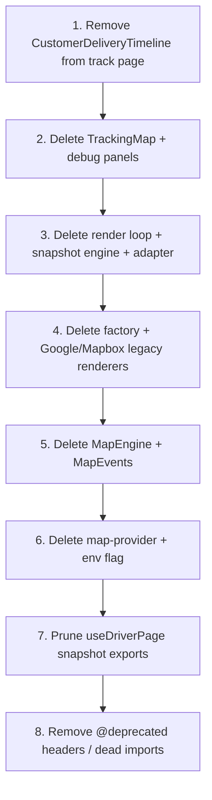

# Tracking Legacy — Removal Plan

**Status:** V2 functional on Customer + Driver. Legacy marked `@deprecated`.  
**Do not delete until validation checklist is complete.**

---

## Files removable after validation

### Core legacy pipeline

| File                                                          | Role                             |
| ------------------------------------------------------------- | -------------------------------- |
| `src/features/maps/components/TrackingMap.tsx`                | Legacy React map + snapshot loop |
| `src/features/maps/tracking/tracking-map-renderer-factory.ts` | Google/Mapbox factory            |
| `src/features/maps/core/map-snapshot-engine.ts`               | Snapshot builder                 |
| `src/features/maps/core/map-snapshot-convergence.ts`          | Convergence gates                |
| `src/features/maps/core/map-snapshot.types.ts`                | Snapshot types                   |
| `src/features/maps/core/map-render-loop.ts`                   | RAF render loop                  |
| `src/features/maps/core/render-map-from-snapshot.ts`          | Snapshot → DOM                   |
| `src/features/maps/core/stable-camera-renderer.ts`            | Camera controller                |
| `src/adapters/mapSnapshotToRenderModel.ts`                    | Snapshot adapter                 |

### Google legacy

| File                                                         | Role                  |
| ------------------------------------------------------------ | --------------------- |
| `src/features/maps/engine/MapEngine.ts`                      | Singleton Google map  |
| `src/features/maps/engine/MapEvents.ts`                      | Engine event bus      |
| `src/features/maps/engine/types.ts`                          | Engine types          |
| `src/providers/google/create-google-tracking-renderer.ts`    | Google bootstrap      |
| `src/providers/google/GoogleMapsRenderer.ts`                 | Google renderer       |
| `src/features/driver/components/DriverGoogleMapsPreload.tsx` | Google script preload |

### Mapbox legacy (tracking renderer)

| File                                              | Role                            |
| ------------------------------------------------- | ------------------------------- |
| `src/providers/mapbox/MapboxRenderer.ts`          | Legacy tracking Mapbox renderer |
| `src/providers/mapbox/mapbox-config.ts`           | Legacy mapbox config            |
| `src/providers/mapbox/driver-marker-icon.ts`      | Legacy marker assets            |
| `src/providers/mapbox/destination-marker-icon.ts` | Legacy marker assets            |
| `src/providers/mapbox/store-marker-icon.ts`       | Legacy marker assets            |

### Debug / forensic (legacy only)

| File                                                   | Role                   |
| ------------------------------------------------------ | ---------------------- |
| `src/features/maps/components/DriverMapDebugPanel.tsx` | Legacy driver debug    |
| `src/features/maps/components/MapRenderDebugPanel.tsx` | Legacy render debug    |
| `src/features/maps/debug/map-forensic-logger.ts`       | Legacy forensic        |
| `src/features/maps/debug/map-lifecycle-trace.ts`       | Legacy lifecycle trace |
| `src/features/maps/debug/map-data-usage.ts`            | Legacy data usage      |

### Config / UI still on legacy path

| File                                                            | Role                            |
| --------------------------------------------------------------- | ------------------------------- |
| `src/config/map-provider.ts`                                    | `NEXT_PUBLIC_MAP_PROVIDER` flag |
| `src/features/tracking/components/CustomerDeliveryTimeline.tsx` | Legacy customer timeline + map  |

### Keep (not tracking legacy)

| File                                               | Reason                                 |
| -------------------------------------------------- | -------------------------------------- |
| `src/features/maps/components/MapTheme.ts`         | May reuse styles                       |
| `src/features/maps/utils/normalize-coordinates.ts` | Shared utility                         |
| `src/integrations/google-maps/*`                   | Checkout geocoding / order destination |
| `src/features/location/*`                          | Checkout Mapbox address picker         |
| `src/features/live-tracking-v2/*`                  | **Replacement system**                 |

---

## Dependencies to verify before deletion

1. **`compute-delivery-state.ts`** — Still uses `TrackingMapSnapshotInput` type from `map-snapshot.types.ts`.
   - **Action:** Move minimal types to `delivery-state.types.ts` or `live-tracking-v2` before deleting snapshot types.

2. **`useDriverPage.ts`** — Still computes `mapSnapshotInput` / `mapDebug` for legacy.
   - **Action:** Remove unused exports after legacy UI removed.

3. **`app/track/[orderId]/page.tsx`** — Legacy `CustomerDeliveryTimeline` + V2 section coexist.
   - **Action:** Remove legacy timeline block when V2 validated; set `ENABLE_TRACKING_V2` permanent.

4. **`map-provider.ts`** — Only used by legacy factory.
   - **Action:** Delete with factory; remove `NEXT_PUBLIC_MAP_PROVIDER` from env docs if unused.

5. **Supabase / GPS** — `useCanonicalDeliveryLocations`, `useLiveDriverLocation` are independent. No DB changes needed.

---

## Recommended deletion order

1. Switch customer track page to V2-only (remove legacy timeline import).
2. Delete `TrackingMap.tsx` and legacy debug panels.
3. Delete snapshot + render-loop stack.
4. Delete `tracking-map-renderer-factory` and provider renderers.
5. Delete `MapEngine` singleton stack.
6. Delete `map-provider.ts`; update `next.config.js` env if needed.
7. Clean `useDriverPage` snapshot/debug exports.
8. Run full validation checklist again.

---

## Rollback strategy

1. Keep this removal in a **dedicated PR** (not mixed with features).
2. Tag release before merge: `pre-legacy-tracking-removal`.
3. Rollback = revert PR; legacy files remain `@deprecated` until re-validated.
4. V2 is behind `ENABLE_TRACKING_V2` on customer page — keep flag until legacy deleted, then remove flag.

---

## Risk assessment

| Risk                            | Severity | Mitigation                                                                     |
| ------------------------------- | -------- | ------------------------------------------------------------------------------ |
| Customer legacy still needed    | Medium   | Complete validation checklist first                                            |
| Type coupling to snapshot types | Medium   | Extract types before phase 3 deletion                                          |
| Accidental Google Maps removal  | Low      | Keep `integrations/google-maps` for geocoding                                  |
| Checkout Mapbox broken          | Low      | `live-tracking-v2/config/mapbox.ts` is separate from legacy `providers/mapbox` |
| HMR regressions                 | Low      | V2 self-contained maps already validated                                       |

---

## Readiness assessment

| Criterion                       | Status                          |
| ------------------------------- | ------------------------------- |
| V2 customer map working         | ✅                              |
| V2 driver map working           | ✅                              |
| Unified telemetry               | ✅                              |
| Debug panel (dev)               | ✅                              |
| Legacy `@deprecated` markers    | ✅                              |
| Validation checklist documented | ✅                              |
| Full manual QA complete         | ⏳ **Required before deletion** |
| Type decoupling from snapshot   | ⏳ **Required before phase 3**  |

**Verdict:** Ready for **validation phase**. Not ready for **legacy deletion** until checklist passes and snapshot types are decoupled from `compute-delivery-state`.
